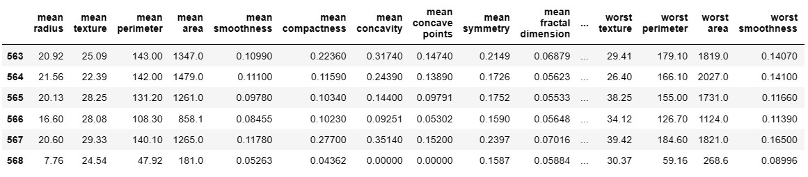

# Breast Cancer Classification with Machine Learning

## Introduction

This project aims to create a machine learning model to classify breast tumors as malignant or benign based on features extracted from digitized fine needle aspiration (FNA) images of breast masses. We use supervised machine learning classifiers to achieve this classification task.

## Dataset

We have used the Scikit-Learn `load_breast_cancer` dataset, which consists of features computed from digitized breast mass images. These features describe characteristics of cell nuclei present in the images. The target variable indicates whether a tumor is malignant (0) or benign (1).

- Total Patients: 569
- Features: 30 (mean, standard error, and worst/largest values of various attributes)
- Data Size: 137.9 KB

### Feature Description

The dataset includes 30 features that provide information about the cell nuclei characteristics. Here are some of the features:

- 'mean radius'
- 'mean texture'
- 'mean perimeter'
- 'mean area'
- 'mean smoothness'
- 'mean compactness'
- 'mean concavity'
- 'mean concave points'
- 'mean symmetry'
- 'mean fractal dimension'
- 'radius error'
- 'texture error'
- 'perimeter error'
- 'area error'
- 'smoothness error'
- 'compactness error'
- 'concavity error'
- 'concave points error'
- 'symmetry error'
- 'fractal dimension error'
- 'worst radius'
- 'worst texture'
- 'worst perimeter'
- 'worst area'
- 'worst smoothness'
- 'worst compactness'
- 'worst concavity'
- 'worst concave points'
- 'worst symmetry'
- 'worst fractal dimension'

## Data Description

The dataset contains 569 patient records, each with 30 numeric features. These features represent various statistical measures and characteristics of cell nuclei. You can further explore the numerical distribution of the data to understand the data's statistics.

## Machine Learning Pipeline

We will follow these steps to build and evaluate our breast cancer classification model:

1. Data Preprocessing: Prepare the data by handling missing values, scaling features, and splitting it into training and testing sets.

2. Model Selection: Experiment with various supervised machine learning classifiers, such as Logistic Regression, Random Forest, Support Vector Machine, etc., to determine the best-performing model.

3. Model Training: Train the selected model on the training data.

4. Model Evaluation: Assess the model's performance using evaluation metrics like accuracy, precision, recall, F1-score, and ROC-AUC.

5. Model Deployment (Optional): If desired, deploy the model for real-world predictions.

## Results

## Results

We evaluated our breast cancer classification model using a variety of machine learning classifiers, and here are the accuracy scores for each classifier:

### Support Vector Classifier

- Without Standard Scaling: 57.89%
- With Standard Scaling: 96.49%

### Logistic Regression

- Without Standard Scaling: 97.37%
- With Standard Scaling: 55.26%

### K – Nearest Neighbor Classifier

- Without Standard Scaling: 93.86%
- With Standard Scaling: 57.89%

### Naive Bayes Classifier

- Without Standard Scaling: 94.74%
- With Standard Scaling: 93.86%

### Decision Tree Classifier

- Without Standard Scaling: 94.74%
- With Standard Scaling: 75.44%

### Random Forest Classifier

- Without Standard Scaling: 97.37%
- With Standard Scaling: 75.44%

### Adaboost Classifier

- Without Standard Scaling: 94.74%
- With Standard Scaling: 94.74%

### XGBoost Classifier

- Without Standard Scaling: 98.24%
- With Standard Scaling: 98.24%

These results demonstrate the performance of each classifier on the breast cancer classification task. The accuracy scores vary between classifiers, and it's important to note that the choice of preprocessing techniques, hyperparameter tuning, and feature selection can influence these results. You can refer to the project documentation for a more detailed analysis of each classifier's performance and potential improvements.

We also provide visualizations of important factors in the classification process, such as feature importance plots and ROC curves, in our project documentation.

## Usage

Instructions for running and reproducing the project's results will be provided in the project code and documentation.

---
